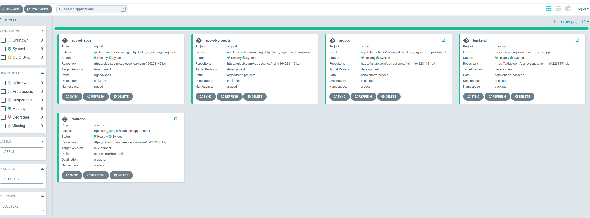
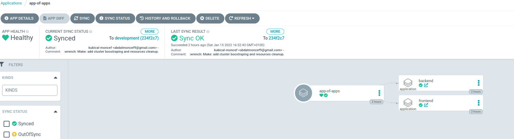
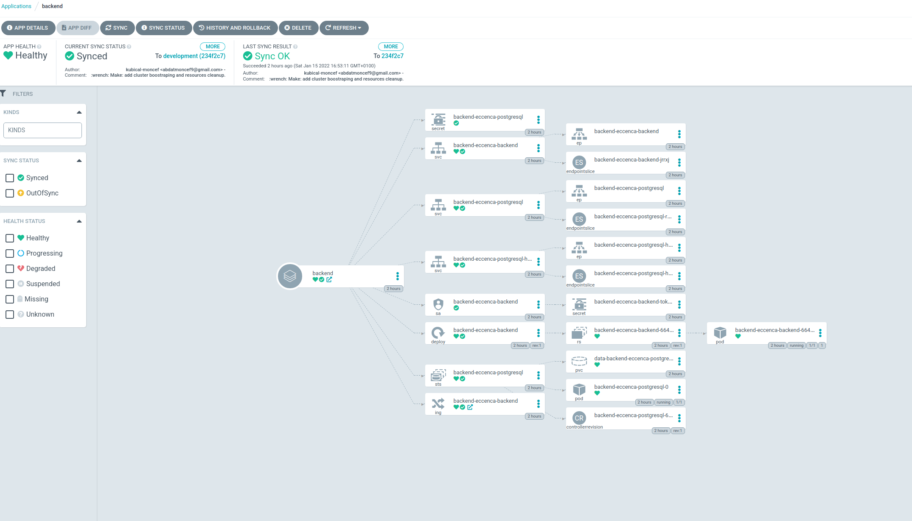

# DevOps Application Test RESTITUTION
## Choices
For this test, I have chosen to use GitOps based automation in association with helm for the application packaging. 
To do so, I have added argocd as a primary tool to the minikube (or K8S cluster).
Here is a piece of doc explaining the core concepts of argocd : https://argo-cd.readthedocs.io/en/stable/core_concepts/

## Architecture

Since ArgoCD enables us to watch over a remote app and syncing to its latest manifests' version, what I have chosen to do is to use the App-of-Apps/App-of-Projects pattern. 
Let's have a ArgoCD installation values for more context:
```sh
server:
  ## ArgoCD config
  ## reference https://github.com/argoproj/argo-cd/blob/master/docs/operator-manual/argocd-cm.yaml
  additionalApplications: 
  - name: argocd
    namespace: argocd
    destination:
      namespace: argocd
      server: https://kubernetes.default.svc
    project: argocd
    source:
      helm:
        version: v3
        valueFiles:
          - values.yaml
          - values-development.yaml
      path: helm-charts/argocd
      repoURL: https://github.com/Kubical-DevOps/eccenca-test.git
      targetRevision: development
    syncPolicy:
      automated:
        prune: false
        selfHeal: false
#### App of Apps
  - name: app-of-apps
    namespace: argocd
    destination:
      namespace: argocd
      server: https://kubernetes.default.svc
    project: argocd
    source:
      path: argocd/apps
      repoURL: https://github.com/Kubical-DevOps/eccenca-test.git
      targetRevision: development
      directory:
        recurse: true
        jsonnet: {}
    syncPolicy:
      automated:
        selfHeal: true
        prune: true
#### App of projects
  - name: app-of-projects
    namespace: argocd
    destination:
      namespace: argocd
      server: https://kubernetes.default.svc
    project: argocd
    source:
      path: argocd/app-projects
      repoURL: https://github.com/Kubical-DevOps/eccenca-test.git
      targetRevision: development
      directory:
        recurse: true
        jsonnet: {}
    syncPolicy:
      automated:
        selfHeal: true
        prune: true
  additionalProjects:
  - name: argocd
    namespace: argocd
    additionalLabels: {}
    additionalAnnotations: {}
    description: Master Argocd Project
    sourceRepos:
    - '*'
    destinations:
    - server: https://kubernetes.default.svc
      namespace: argocd
    clusterResourceWhitelist:
    - group: '*'
      kind: '*'
```
>*This the interesting part* 

First things first, we are deploying argocd by the use of Helm.
**It is the only helm chart we will have to install from our localhost, all the other charts will be managed by Argocd**

The file above is extracted from values-development (*I have chosen to call this env development*). 
Bear the argocd application. We are referencing the argocd application that we are about to install as an application (first additionalApplication) to be managed by argocd itself...
**Wait? Inception?**
Yes, argocd is able to watch itself for any changes occuring in the helm chart manifests which have been used for it's installation.
**So what are the other apps for?**
The other apps are sort of "meta-apps" if you will:
- One is used to manage all the other applications: the App-of-Apps
- The other is used to managed all the projects (except the argocd project dedicated to argocd itself): The App-of-Projects

Once ArgoCD being able to reach our git repo, it will create these two apps which have the responsability to watch over the argocd/apps and argocd/app-projects directories. *I have created sub-directories to demonstrate the possibility of having multiple environments managed and bootstrapped quickly.*
What we are left with are applications and applicationProjects defined in the argocd/app directorie which are the "real" applications (the applications I had to deploy). These applications point to the helm-chart folder in the same repository and tell the application to use a specific values.yaml file (values-development.yaml in this case).
The app-projects are for access-control. They restrict the ressources that can be created and RBAC can be configured on them for granular access control on the resources. For more info, see https://argo-cd.readthedocs.io/en/stable/user-guide/projects/
>Projects provide a logical grouping of applications, which is useful when Argo CD is used by multiple teams. Projects provide the following features:
> - restrict what may be deployed (trusted Git source repositories)
> - restrict where apps may be deployed to (destination clusters and namespaces)
> - restrict what kinds of objects may or may not be deployed (e.g. RBAC, CRDs, DaemonSets, NetworkPolicy etc...)
> - defining project roles to provide application RBAC (bound to OIDC groups and/or JWT tokens)

**What do we have putting everything together?**
We have a autonomous GitOps eco-system. If you wish to deploy a new application, of clone an existing application but with other values, all you'll have to do is create an application file under argocd/apps/<env>. For instance we could imagine something like:
```sh
apiVersion: argoproj.io/v1alpha1
kind: Application
metadata:
  name: backend-production
  namespace: argocd
spec:
  project: backend
  source:
    repoURL: 'https://github.com/Kubical-DevOps/eccenca-test.git'
    path: helm-charts/backend
    targetRevision: development
    helm:
      valueFiles:
        - values-production.yaml
      version: v3
  destination:
    server: 'https://kubernetes.default.svc'
    namespace: backend
  syncPolicy:
    syncOptions:
      - CreateNamespace=true
    automated:
      selfHeal: true
      prune: true
```
**Notice how the target revision always references the development branch. It is because it is the only branch I have created and where everything is located. After merging to master, we can consider having targetRevision value to HEAD (on a production environement for example).**


## Usage

I have added to the make init command a cluster boostraping step. 
So the make init command itself is supposed to bootstrap the whole cluster and all the apps will gradualy by created one after the other.
Try it yourself:
- **IMPORTANT: IN ORDER TO MAKE THE PROJECT WORK FOR A PRIVATE REPO, YOU'LL NEED A GPG KEY TO ENCRYPT ARGOCD SECRETS.YAML FILE**
- ```make init```. Keep the ArgoCD admin password, you'll need it
- get the ip of your minikube cluster with ```minikube ip```
- add to your /etc/hosts file the ip you have found above for argocd.local, frontend.local, backend.local
- by the time you'll have modified your /etc/hosts, chances are ArgoCD is up and running already.
- visit argocd.local and login with as admin, with the password of step 2.
- You'll slowly see applications appear. Argocd, app-of-apps and app-of-projects first, and then the "real" applications defined in argocd/apps
- ```make k8s-backup``` to backup DB from backend namespace
- ```make k8s-cleanup``` to delete all created assets
- ```make cleanup``` to delete minikube itself

**You might want to refresh your app-of-apps & app-of-projects applications after creation in case the repo-server service is not yet exposed as a NodePort and hence cannot receive, at the creation time, incomming traffic from Gitlab.com**

**Also, due to performance issues your computer might encounter, pods in the argocd namespace might be slow to create (especially on cluster creation). This will most probably cause the admin password to not be created after the make init command is finished. The message will hence be ```ArgoCD admin password: ```. If it is the case, wait for the resources to be fully created in the argocd namespace and run ```kubectl -n argocd get secret argocd-initial-admin-secret -o jsonpath="{.data.password}" | base64 -d```**




## Pain Points

I have lost quite some time because of a bug in the frontend application which does not actually send POST requests after creation event. I thought I could fix it but I really am no frontend developper. Instead, I have figured out the requested payload by the flask application and have sent it using curl. 

## Do not hesistate to contact me for more oral explainations.
